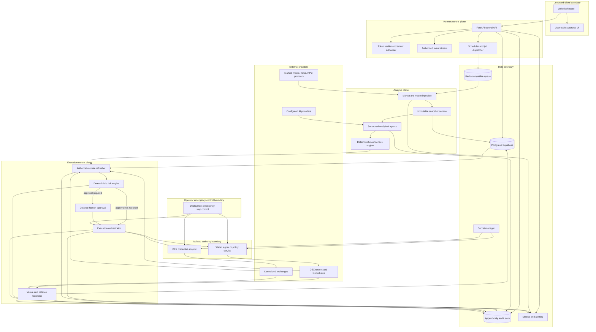

# Hermes Canonical Architecture

**Version:** 1.0.0-draft  
**Last revised:** 2026-07-20  
**Owner role:** Architecture owner  
**Review cadence:** Quarterly and after any custody, identity, venue, or data-flow change

## 1. Purpose and scope

This document is the canonical architectural description of Hermes. It resolves the previous conflict between a local self-custodial bot, a hosted multi-tenant service, and an institutional protocol by defining distinct deployment and transaction-authority modes.

Hermes is a **policy-controlled trading automation system**. It is not inherently decentralized, non-custodial, autonomous, compliant, or institution-ready. Those characteristics are properties of a specific deployment and must be demonstrated separately.

The architecture covers:

- deployment modes;
- custody and transaction authority;
- identity and tenant authorization;
- data classification and storage;
- trust boundaries;
- analytical and execution components;
- DEX and CEX venues;
- failure containment and audit evidence.

The [Execution Protocol](ExecutionProtocol.md) is normative for decision and order behavior. The [OpenAPI contract](../openapi/hermes.openapi.yaml) is normative for HTTP interfaces.

## 2. Architectural principles

1. **Separation of analysis, risk, and authority.** Analytical agents propose structured assessments. A deterministic consensus function aggregates them. A deterministic risk engine authorizes or rejects order intents. Only an isolated signer or credential adapter may authorize a venue request.
2. **Fail closed.** Unknown, stale, unavailable, or ambiguous state prevents new live orders.
3. **Least authority.** Wallet delegation and exchange credentials are limited by venue, asset, contract, amount, time, and operation wherever the platform supports those constraints.
4. **Server-derived tenancy.** Tenant and principal identifiers come from verified authentication and membership records, not request bodies.
5. **Immutable evidence.** Inputs, policies, decisions, order attempts, and reconciliation results are versioned and hash-linked.
6. **No secret propagation.** Private keys and CEX secrets do not enter the browser, database records, logs, prompts, telemetry, or source repository.
7. **Simulation first.** Every strategy and venue adapter starts in simulation or sandbox mode. Live enablement is a separately approved change.
8. **Explicit operator role.** Privacy, security, and contractual responsibilities depend on who operates the stack and signer.

## 3. Deployment modes

### 3.1 Managed multi-tenant service

The Hermes service operator hosts the web application, API, workers, queue, Postgres/Supabase project, observability, and managed integration credentials. Multiple customer tenants share the control plane, but every tenant-owned row, event, secret reference, job, and stream is scoped by an internal tenant identifier.

Required properties:

- the browser accesses trading data only through the Hermes API or a backend-authorized event stream;
- production application connections use a database role without `BYPASSRLS` and without table ownership;
- direct client access to internal trading tables is disabled;
- tenant context is set transaction-locally and verified by forced RLS;
- secret values are held in a managed secret store, while the database stores opaque references;
- delegated wallet execution is opt-in, scoped, time-bounded, and revocable;
- CEX credentials are tenant-specific, environment-specific, trading-only, and withdrawal-disabled;
- operations personnel access is role-based, logged, reviewed, and limited to support or incident needs.

This mode is not accurately described as “developers cannot access configuration” or “no data is collected.” The operator processes account, configuration, trading, security, and service data as described in [Data Inventory](DataInventory.md) and [Privacy Policy](../PRIVACY.md).

### 3.2 Dedicated single-tenant deployment

A separate application stack, database, queue, observability environment, and secret namespace serve one customer. The stack may run in the operator’s cloud account, the customer’s cloud account, or a contractually approved environment.

Preferred properties:

- customer-managed KMS, HSM, MPC service, or external signer;
- private network paths to the database, signer, and venue gateways;
- customer identity provider through OIDC where required;
- customer-defined retention, backup, audit-export, and approval controls;
- no shared application runtime or database with other customers;
- customer-approved subprocessor and support-access model.

A dedicated deployment reduces shared-infrastructure risk but does not remove software, credential, venue, market, or operator risk.

### 3.3 Self-hosted deployment

The customer or user operates the UI, API, workers, database, queue, signer, secrets, and monitoring. Hermes maintainers do not receive deployment data unless the operator explicitly enables support, update telemetry, or external services.

Required properties:

- the operator supplies and secures all credentials;
- raw wallet keys are held only in a customer-controlled signer or secure wallet, not a generic application `.env` file;
- the operator is responsible for backups, patching, legal notices, monitoring, incident response, and venue compliance;
- managed-service claims in Hermes legal documents do not apply unless separately contracted.

### 3.4 Environment separation

Each deployment mode has independent `development`, `staging`, and `production` environments. They MUST use separate databases, queues, identity applications, secret namespaces, wallet addresses, CEX subaccounts or API keys, observability projects, and domains. Production credentials MUST NOT be copied into development or staging.

Live execution is prohibited in development. Staging uses testnets, paper accounts, or venue sandboxes. Production begins with live execution disabled.

## 4. Custody and transaction authority

“Custody” and “self-custody” are insufficiently precise for automated trading. Hermes documents both **key ownership** and **transaction authority**.

| Mode | Key material | Who can cause a transaction | Hermes operator authority | Required controls |
|---|---|---|---|---|
| **User-in-loop wallet** | External or user-owned embedded wallet | User approves each transaction | Can prepare a transaction but cannot complete it without user authorization | Clear transaction preview, expiry, chain/contract/amount validation |
| **Delegated policy wallet** | Wallet provider or customer signer; raw key is not delivered to Hermes application services | A Hermes signer identity may execute within a user-approved policy | Can cause transactions within the active delegation; this is delegated transaction authority | Contract/recipient allowlists, amount and time limits, revocation, independent signer policy, audit trail |
| **Customer-managed signer** | Customer HSM, KMS, MPC, hardware wallet, or signing service | Customer-controlled policy and approval path | No direct key access; only submits signing envelopes | Mutual authentication, allowlists, request digest verification, signed response, availability runbook |
| **CEX API credential** | Exchange-issued API key and secret in a secret manager | Hermes venue adapter can place/cancel orders within exchange permissions | Trading authority on the linked account; no withdrawal authority under baseline policy | Withdrawals disabled, IP restrictions where available, subaccount isolation, rotation, reconciliation |
| **Simulation/paper** | No live key | No live transaction | None | Default for development and onboarding |

### 4.1 Prohibited key handling

Hermes application services MUST NOT:

- store raw wallet private keys or seed phrases in source control, database columns, ordinary `.env` files, CI variables, frontend build settings, logs, traces, support tickets, or model prompts;
- export a user wallet key as part of normal execution;
- place signing material in a Vite-prefixed environment variable;
- reuse signer or exchange credentials across environments or tenants.

A signer may itself use environment injection only when backed by a workload identity or secret manager and when key material remains inside an isolated process with no general application access. Dedicated deployments should prefer an HSM, MPC, KMS, or customer-controlled signing service.

### 4.2 Delegation disclosure

A delegated wallet may remain user-owned while giving a server signer the ability to execute permitted transactions. The UI and Terms MUST disclose the exact contracts, assets, limits, expiration, revocation path, and whether the server can update the policy. “Self-custodial” MUST NOT be used to imply that the application lacks transaction authority when an active delegation exists.

## 5. Logical component model

### 5.1 Web dashboard

The Vite/React dashboard is an untrusted client. It may contain only public configuration such as API origin, Privy application identifier, release version, and non-secret feature flags. It MUST NOT contain database service keys, AI keys, exchange secrets, signer credentials, or wallet private keys.

The dashboard receives tenant data through the authenticated Hermes API and event stream. It does not write directly to internal Postgres tables.

### 5.2 Control API

The FastAPI service:

- verifies the identity token;
- maps the external identity to an internal principal and tenant membership;
- enforces roles and scopes;
- derives tenant context server-side;
- validates requests against the OpenAPI/Pydantic model;
- creates idempotency records and jobs;
- exposes decisions, executions, orders, fills, controls, and audit evidence;
- never signs a blockchain transaction itself.

### 5.3 Scheduler and queue

Long-running ingestion, reasoning, execution, and reconciliation tasks run in workers, not Vercel edge functions. Jobs include `tenant_id`, `correlation_id`, immutable input references, policy versions, attempt count, and deadline. Workers verify the job tenant and resource ownership before processing.

The queue provides at-least-once delivery. Idempotent consumers and database uniqueness constraints prevent duplicate effects.

### 5.4 Snapshot service

The snapshot service creates a canonical, immutable view of the information available to a decision:

- instrument and venue scope;
- prices, quotes, order-book or liquidity data;
- portfolio balances, open orders, and exposure;
- macro or narrative features if enabled;
- source identifiers, timestamps, sequence numbers, quality flags, and freshness;
- canonical payload hash.

Agents reference the snapshot by identifier and do not fetch mutable market data independently during the same decision. Risk evaluation remains bound to that immutable snapshot, but it also uses a controller-owned refresh of authoritative portfolio, account, circuit-breaker, and venue state captured as close as practical to submission.

### 5.5 Analytical agents

Agents are provider adapters that return schema-valid assessments. They may use deterministic models, statistical models, LLMs, or rules. A deployment is not agent-provider-specific.

Agents have no signer, venue, secret-manager, or order-submission permission. Raw provider output is parsed in a sandboxed adapter, validated, redacted, and converted to the canonical assessment schema. Invalid output becomes `ABSTAIN` and is retained only according to the data policy.

### 5.6 Consensus engine

The consensus engine is a pure deterministic function over immutable assessments and a versioned policy. It reports quorum, support, abstention, disagreement, exclusions, and a digest. It does not estimate guaranteed return and does not authorize capital.

### 5.7 Risk engine

Before each risk evaluation, the authoritative state refresher obtains current portfolio balances, positions, open orders, reservations, venue health and precision, applicable circuit breakers, account permissions, and chain state from controller-approved sources. The refresh is versioned or digested and retained with the original decision snapshot; it cannot mutate that snapshot.

The risk engine evaluates the immutable decision snapshot and refreshed authoritative state against policy limits and the consensus record. It calculates the permitted order, which may be smaller or more restrictive than the proposed order. Every rule returns a machine-readable result. A missing, stale, ambiguous, or unknown mandatory input causes rejection.

### 5.8 Execution orchestrator

The orchestrator creates an immutable order intent, obtains any required human approval, requests signing or credential use, submits to one venue, monitors state, and initiates reconciliation. It does not silently reroute a failed order to another venue because doing so changes economics and counterparty risk; rerouting requires a new quote and risk evaluation.

### 5.9 Signer and credential boundary

The wallet signer validates a signed or mutually authenticated signing envelope against an independently configured policy. The CEX credential adapter obtains a tenant-specific secret at execution time and exposes only the minimum venue operation required.

Neither boundary returns raw secret material. Both emit an operation identifier and evidence digest.

### 5.10 Reconciler

The reconciler treats venue state as authoritative for fills and chain state as authoritative for on-chain finality. It compares internal orders, exchange orders, transactions, fills, fees, balances, nonces, and allowances. Ambiguous submission state blocks conflicting retries until resolved.

## 6. Identity and tenant flow

### 6.1 Authentication

Privy is the default managed-service identity provider. Dedicated or self-hosted deployments may use an approved OIDC provider.

1. The user authenticates in the browser.
2. The identity provider issues a short-lived access token.
3. The browser sends the bearer token to the Hermes API over TLS.
4. The API verifies signature, algorithm, issuer, intended audience or application identifier, expiration, not-before time where present, token type, and required subject/session claims.
5. Through a separate identity connection, the API maps the verified provider and external subject, such as a Privy DID, to an internal immutable `principal_id` using the exact-match `hermes.lookup_principal` function. The request-time role has no direct principal-table access.
6. The API sets `app.principal_id` transaction-locally on the identity connection and loads only that principal's active memberships under dedicated RLS policies. It selects the tenant from this server-side result. A requested tenant header is only a selector and MUST match membership. Principal provisioning and status changes use a separate control-plane identity.
7. The API creates an authorization context containing `principal_id`, `tenant_id`, role, scopes, session identifier, authentication time, and correlation identifier.
8. Database transactions set `app.principal_id` and `app.tenant_id` with `SET LOCAL`; forced RLS verifies every tenant-owned row.
9. Audit records capture the internal principal, external identity-provider reference, session identifier hash, action, resource, and result.

### 6.2 Authorization roles

Baseline roles are:

- `viewer`: read dashboards, decisions, orders, fills, and audit exports;
- `operator`: manage strategies, request simulation, and respond to operational incidents;
- `trader`: request execution and cancel orders within policy;
- `approver`: approve executions that require human authorization;
- `tenant_admin`: manage members, venues, wallets, credentials, and policies;
- `security_admin`: manage incident controls and credential rotation;
- `platform_admin`: managed-service operational role; no routine tenant trading authority.

Sensitive actions require explicit scopes and may require step-up authentication or dual approval. Roles are not inferred from email domain or wallet address.

### 6.3 Database authorization

The application path MUST NOT use Supabase `service_role`, a secret key, a table-owner connection, or a role with `BYPASSRLS`. Elevated credentials are reserved for migrations, controlled maintenance, and break-glass recovery.

The canonical SQL migration:

- uses a private `hermes` schema;
- denies access to anonymous and ordinary Supabase API roles;
- defines non-bypass application roles;
- enables and forces RLS;
- applies `USING` and `WITH CHECK` policies;
- prevents application updates or deletes to audit events;
- constrains each tenant audit chain to one root, an existing same-tenant predecessor, and one successor per predecessor;
- indexes tenant keys used by policies;
- records idempotency and uniqueness constraints.

The migration is a tenant-isolation baseline, not evidence of service-level least privilege. Production deployments must use separate login identities, restrict each identity to the required NOLOGIN role and operations, prevent role chaining into a more privileged application role, and test the effective grants for API, worker, identity, auditor, migration, backup, and break-glass paths.

Realtime data is delivered by the Hermes API or an explicitly tenant-scoped publication. Internal tables are not generally exposed through PostgREST.

## 7. Data inventory and retention

The authoritative inventory is [DataInventory.md](DataInventory.md). Key design decisions are:

- raw LLM prompts and responses are not stored in managed production by default;
- model evidence stores structured assessments, provider/model identifiers, prompt version, token/latency metrics, redacted rationale, and input/output digests;
- the database stores secret references, not secret values;
- IP addresses and request metadata may be processed for security, abuse prevention, and reliability; retention is bounded and disclosed;
- DEX transactions and public wallet addresses become public blockchain data and cannot be deleted by Hermes;
- CEX trading records are private to the account and exchange, subject to the exchange’s terms and retention;
- audit, order, fill, and risk records use a documented retention schedule and legal hold process.

## 8. Trust boundaries and threats

| Boundary | Untrusted or higher-risk input | Primary controls | Failure posture |
|---|---|---|---|
| Browser → API | Tokens, identifiers, parameters, replayed requests | TLS, token verification, schema validation, authorization, idempotency, rate limits | Reject |
| External data → snapshot | Stale, manipulated, divergent, missing data | Source allowlist, timestamps, sequence checks, source quorum, quality flags | No live decision |
| AI provider → agent adapter | Prompt injection, malformed output, hallucination, data leakage | Minimal context, structured output, validation, redaction, no tools/secrets, timeout | `ABSTAIN` |
| Consensus → risk | Correlated agent error, miscalibrated confidence | Separate agreement/confidence metrics, versioned weights, offline evaluation | Risk independently rejects |
| API/worker → database | Cross-tenant access, privilege escalation | Non-bypass role, forced RLS, transaction-local context, grants, tests | Transaction fails |
| Orchestrator → signer | Altered recipient, amount, chain, calldata, replay | Signed envelope, expiry, nonce, policy allowlists, digest verification | Refuse signature |
| Orchestrator → CEX | Duplicate order, excess permission, ambiguous timeout | Client order ID, withdrawal-disabled credential, limits, reconciliation | Freeze conflicting retry |
| Venue → reconciler | Partial fill, reorg, API inconsistency | Polling/webhook correlation, finality policy, balance reconciliation | Mark ambiguous; pause affected scope |
| Operator → tenant | Support misuse or credential access | RBAC, just-in-time access, approval, immutable audit, secret separation | Revoke and investigate |

The detailed threat model and controls are in [Security Policy](SecurityPolicy.md).

## 9. Execution venues

### 9.1 Venue registry

Every venue is defined in a versioned registry validated by `schemas/venue-registry.schema.json`. A venue record includes:

- stable `venue_id` and type (`DEX` or `CEX`);
- network and chain identifier where applicable;
- adapter and version;
- environment (`sandbox`, `testnet`, or `mainnet`);
- supported instruments and order types;
- credential or signer reference;
- contract/router/program allowlists;
- finality settings and a timeout-policy reference;
- notional, slippage, price-impact, and rate-limit policy;
- health state and an operational-owner reference.

A venue is unavailable unless it is present and its status permits the requested execution mode. `sandbox` permits only simulation or sandbox activity; `enabled` is required for an approved live scope. `disabled`, `paused`, and `degraded` reject new live submissions. A documented incident policy may still permit strictly non-submission operations such as lookup, cancel, or reconciliation.

### 9.2 DEX execution

DEX adapters may support approved EVM or Solana venues, including routers or direct protocols. Brand names in examples do not imply production support. Each adapter must define:

- chain ID and RPC quorum;
- approved router or program addresses;
- permitted function selectors or instructions;
- token allowlist and decimal handling;
- quote source, route expiry, minimum received amount, maximum price impact, deadline, gas/fee ceiling, nonce handling, and finality depth;
- allowance policy and revocation procedure;
- MEV and transaction-privacy assumptions;
- reorg, dropped, replaced, and stuck-transaction handling.

Bitcoin and BRC-20 execution are outside the baseline architecture. They may be observed as market data only until a separately reviewed execution adapter exists.

### 9.3 CEX execution

CEX adapters use exchange-native clients or a reviewed abstraction such as CCXT. Each adapter must define:

- exact exchange and account/subaccount;
- symbol normalization and precision rules;
- supported order types and time-in-force values;
- client-order-ID behavior;
- rate limits and retry semantics;
- partial-fill, cancel, and amend behavior;
- websocket and REST reconciliation;
- credential permissions and IP restrictions;
- maintenance, outage, and delisting behavior.

CEX trades are not public on-chain transactions. Deposits and withdrawals may create blockchain records, but order placement and matching occur in the exchange’s systems.

## 10. Data flow by deployment mode

| Flow | Managed multi-tenant | Dedicated | Self-hosted |
|---|---|---|---|
| Identity | Operator-configured Privy by default | Privy or customer OIDC | Customer-selected identity provider |
| API and workers | Operator cloud | Isolated operator/customer environment | Customer environment |
| Database | Shared project with forced RLS | Separate project/cluster | Customer database |
| Secrets | Managed secret store | Dedicated/customer secret store | Customer secret store |
| Wallet signer | User-in-loop or delegated provider policy | Customer signer preferred | Customer signer |
| CEX credentials | Operator secret store, per tenant | Dedicated/customer secret store | Customer secret store |
| AI and data providers | Operator-approved processors | Contractually selected | Customer-selected |
| Support access | JIT, approved, audited | Contract-specific | None unless granted |

## 11. Availability and failure containment

- The API, workers, database, queue, signer, market-data providers, RPCs, and venues have independent health states.
- A user-interface outage does not authorize new trades.
- A reasoning-provider outage produces abstentions; it does not lower quorum automatically.
- A queue retry cannot create a second economic effect because every stage uses a unique idempotency or intent key.
- A signer outage leaves execution in `SIGNING` or `SIGNING_FAILED`; it does not bypass approval.
- An ambiguous venue submission activates an instrument/account-scoped tenant circuit breaker until reconciliation.
- A deployment-wide emergency stop is an out-of-band operator control enforced independently by execution workers and the signer/CEX credential boundary; it is not exposed through tenant circuit-breaker APIs.
- Boot-time live-enable flags default to false. In production, a strongly authenticated runtime control is required, and unavailable, expired, malformed, or unverifiable control state fails closed.
- A deployment-wide stop is coordinated, not atomic across independent venues. Already submitted transactions or orders may continue and must be managed according to venue capabilities.

Recovery objectives and runbooks are defined in [Operations Manual](OperationsManual.md).

## 12. Observability and audit

Metrics and logs use correlation identifiers but exclude access tokens, private keys, seed phrases, CEX secrets, full authorization headers, raw model prompts/responses, and unnecessary personal data.

Audit events are append-only to application roles and contain canonical payload hashes plus a previous-event hash per tenant stream. Application roles cannot insert the table directly; `hermes.append_audit_event` verifies tenant context and serializes the current head. The SQL baseline rejects multiple roots, missing or cross-tenant predecessors, self-links, and multiple successors for one predecessor. An independent verifier must still detect invalid digests and missing database or archive events. Structural constraints and direct-write denial do not establish digest correctness or collection completeness.

A periodic root may be written to WORM-capable object storage or optionally anchored to a public chain. Hash chaining provides tamper evidence; it does not prove completeness unless collection controls and independent retention are also verified.

## 13. Non-goals

The baseline architecture does not claim:

- guaranteed profitability, “high-probability” returns, or calibrated investment advice;
- atomic global shutdown across unrelated blockchains and exchanges;
- zero-knowledge proofs of reasoning;
- universal multi-chain support;
- regulatory compliance by architecture alone;
- complete decentralization;
- inability of a delegated operator to cause transactions within an active policy;
- protection against all venue insolvency, chain failure, market manipulation, or model error.

## 14. Implementation conformance gates

Before a deployment may be described as conformant or enabled for live trading, evidence must show:

- [ ] deployment and custody mode selected and disclosed;
- [ ] identity-token verification tests cover issuer, audience, signature, expiry, wrong app, revoked session, and role changes;
- [ ] cross-tenant negative tests cover every table, stream, file, job, cache, and API route;
- [ ] application database role cannot bypass forced RLS;
- [ ] service-specific database identities cannot assume broader roles or perform operations outside their reviewed grant matrix;
- [ ] frontend bundle contains only approved public variables;
- [ ] no raw private keys or CEX secrets exist in source, CI, database, logs, or model payloads;
- [ ] signer policy independently constrains contracts, recipients, amounts, methods, time, and replay;
- [ ] risk and consensus functions are deterministic and covered by property and regression tests;
- [ ] every risk decision binds the immutable decision snapshot to a fresh, digested authoritative-state record;
- [ ] idempotency tests cover concurrent duplicate requests and payload mismatch;
- [ ] venue adapters pass sandbox/testnet conformance, precision, partial-fill, timeout, and reconciliation tests;
- [ ] circuit breakers fail closed and are exercised in a game day;
- [ ] audit tests cover concurrent append, predecessor uniqueness, gap/fork detection, digest verification, and independent export completeness;
- [ ] backup and restore meet approved RPO/RTO and include object storage where used;
- [ ] incident, stale-data, duplicate-order, venue-outage, and ambiguous-transaction runbooks are exercised;
- [ ] privacy, terms, subprocessor, retention, and support-access statements match the deployed configuration;
- [ ] independent security review and legal review are complete where required;
- [ ] marketing claims are supported by current evidence.

## 15. External implementation references

The design assumes the operator follows current provider guidance, including server-side verification of short-lived identity tokens; restrictive RLS and non-exposure of Supabase secret/service-role keys; the fact that Vite-prefixed variables are bundled into client code; explicit wallet owners, signers, and enforceable policies for delegated execution; and separate backup handling for database and object storage.

Primary references revalidated on 2026-07-20:

- [Privy access-token verification](https://docs.privy.io/authentication/user-authentication/access-tokens)
- [Supabase data security](https://supabase.com/docs/guides/database/secure-data)
- [Supabase Row Level Security](https://supabase.com/docs/guides/database/postgres/row-level-security)
- [Vite environment-variable exposure](https://vite.dev/guide/env-and-mode)

Provider behavior and these links must be revalidated during each release review.
